# ASVspoof Audio Deepfake Detector

A machine learning project for detecting synthetic / spoofed speech using the ASVspoof 2019 Logical Access dataset.

This project compares three different audio deepfake detection approaches:

- Random Forest classifier with MFCC-based statistical features
- PyTorch Multi-Layer Perceptron (MLP) with MFCC-based statistical features
- PyTorch CNN with mel spectrogram features

The goal is to build a clean and reproducible audio deepfake detection pipeline, starting from raw audio files and ending with model evaluation and single-audio prediction.

---

## Project Overview

Audio deepfakes can be generated using text-to-speech (TTS) and voice conversion (VC) systems.

This project focuses on classifying audio samples as:

- `bonafide`: genuine human speech
- `spoof`: synthetic or manipulated speech

The pipeline follows these steps:

```text
Raw FLAC audio
→ ASVspoof protocol parsing
→ balanced subset creation
→ MFCC / mel spectrogram feature extraction
→ model training
→ dev and eval evaluation
→ single audio prediction
```

---

## Dataset

This project uses the **ASVspoof 2019 Logical Access (LA)** dataset.

The raw dataset is not included in this repository because of size and licensing restrictions.

Expected local dataset structure:

```text
data/
└── raw/
    ├── ASVspoof2019_LA_train/
    │   └── flac/
    ├── ASVspoof2019_LA_dev/
    │   └── flac/
    ├── ASVspoof2019_LA_eval/
    │   └── flac/
    └── ASVspoof2019_LA_cm_protocols/
        ├── ASVspoof2019.LA.cm.train.trn.txt
        ├── ASVspoof2019.LA.cm.dev.trl.txt
        └── ASVspoof2019.LA.cm.eval.trl.txt
```

For this experiment, balanced subsets were created from train, dev, and eval splits.

Each balanced subset contains:

```text
1000 bonafide samples
1000 spoof samples
Total: 2000 audio samples
```

---

## Exploratory Data Analysis

Before training the models, the dataset was explored visually using a balanced subset of bonafide and spoof audio samples.

### Balanced Subset Distribution

The original ASVspoof 2019 LA training split is imbalanced, with many more spoof samples than bonafide samples.

For this baseline experiment, a balanced subset was created with 1,000 bonafide and 1,000 spoof samples.

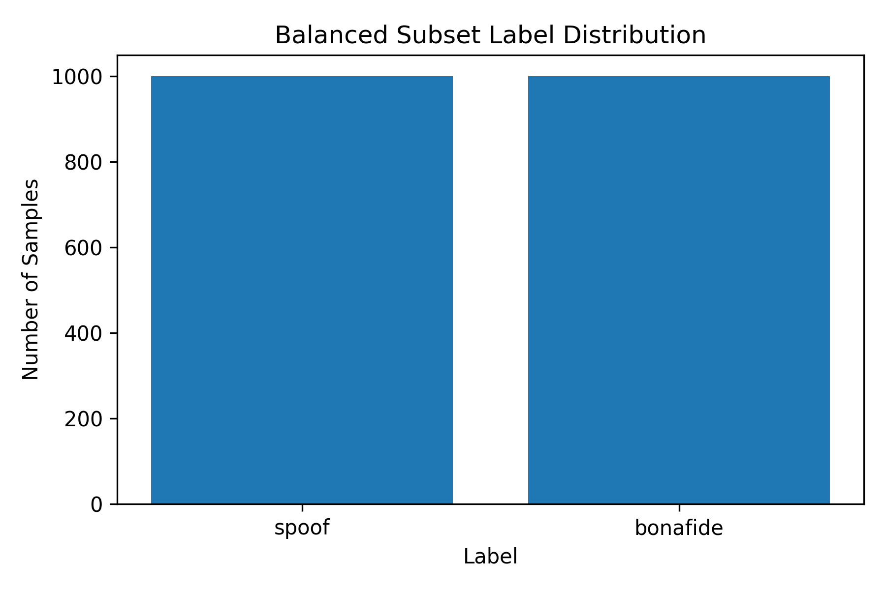

### Bonafide vs Spoof Waveform

The waveform shows how the audio amplitude changes over time.

Below is a comparison between one bonafide sample and one spoof sample from the balanced subset.

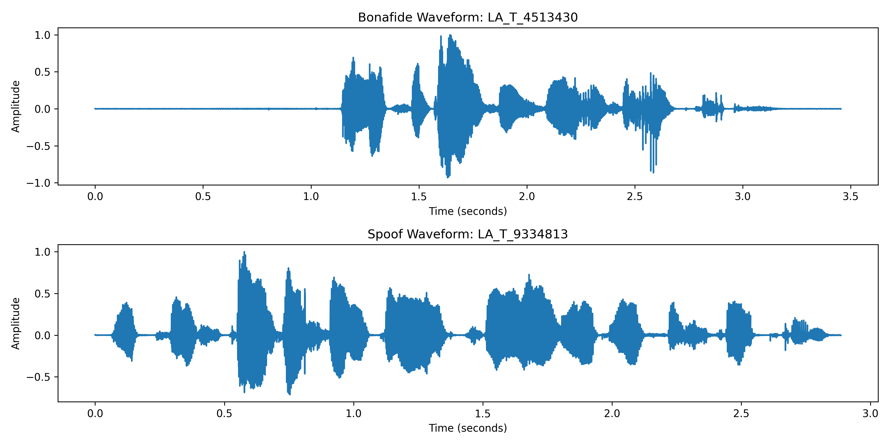

### Bonafide vs Spoof Mel Spectrogram

The mel spectrogram shows how frequency energy changes over time.

This representation is useful for audio analysis because it reveals time-frequency patterns that may not be obvious from the raw waveform.

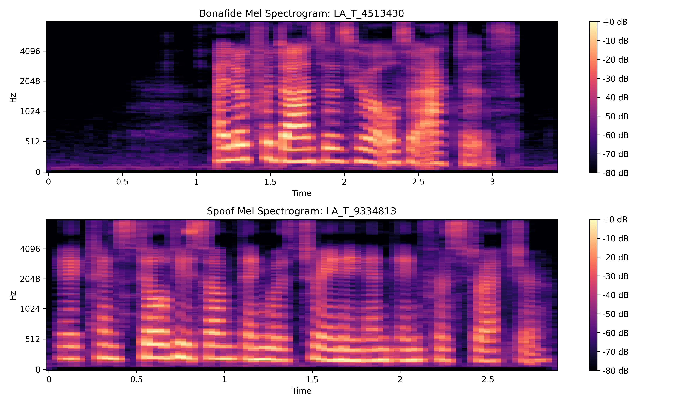

---

## Feature Extraction

This project uses two feature extraction approaches.

### MFCC-Based Statistical Features

For each audio file, the following MFCC-based features are extracted:

- MFCC mean
- MFCC standard deviation
- Delta MFCC mean
- Delta MFCC standard deviation
- Delta-delta MFCC mean
- Delta-delta MFCC standard deviation

With `20 MFCCs`, this produces a 120-dimensional feature vector:

```text
20 + 20 + 20 + 20 + 20 + 20 = 120 features
```

These features are used by:

- Random Forest
- PyTorch MLP

### Mel Spectrogram Features

For the CNN model, each audio file is converted into a fixed-size mel spectrogram tensor.

The CNN input shape is:

```text
1 x 128 x 128
```

This means:

```text
1 channel
128 mel frequency bins
128 time frames
```

These features are used by:

- Spectrogram CNN

---

## Model Results

The models were first trained and evaluated using a balanced 2,000-sample train subset with an 80/20 train-validation split.


| Model           | Feature Type    | Train Split Accuracy | Spoof Precision | Spoof Recall | Spoof F1 |
| --------------- | --------------- | -------------------- | --------------- | ------------ | -------- |
| Random Forest   | MFCC statistics | 0.9100               | 0.9409          | 0.8750       | 0.9067   |
| PyTorch MLP     | MFCC statistics | 0.9875               | 0.9899          | 0.9850       | 0.9875   |
| Spectrogram CNN | Mel spectrogram | 0.9925               | 0.9900          | 0.9950       | 0.9925   |


The Spectrogram CNN achieved the strongest initial train split result.

---

## Dev and Eval Set Evaluation

After the initial train/test split experiment, I evaluated the trained models on separate balanced subsets from the ASVspoof 2019 LA development and evaluation sets.

This gives a more realistic view of model generalization because the dev and eval samples were not used during training.

The balanced dev subset contains:

```text
1000 bonafide samples
1000 spoof samples
Total: 2000 dev samples
```

The balanced eval subset contains:

```text
1000 bonafide samples
1000 spoof samples
Total: 2000 eval samples
```

### Train Split vs Dev vs Eval Results


| Model           | Feature Type    | Train Split Accuracy | Dev Accuracy | Eval Accuracy | Eval Spoof Precision | Eval Spoof Recall | Eval Spoof F1 |
| --------------- | --------------- | -------------------- | ------------ | ------------- | -------------------- | ----------------- | ------------- |
| Random Forest   | MFCC statistics | 0.9100               | 0.9040       | 0.8840        | 0.9257               | 0.8350            | 0.8780        |
| PyTorch MLP     | MFCC statistics | 0.9875               | 0.8955       | 0.8665        | 0.8920               | 0.8340            | 0.8620        |
| Spectrogram CNN | Mel spectrogram | 0.9925               | 0.9815       | 0.9175        | 0.9815               | 0.8510            | 0.9116        |


The Spectrogram CNN achieved the strongest overall performance across the train split, dev subset, and eval subset.

The MLP achieved a very high initial train split score, but its performance dropped more on the dev and eval subsets. The Random Forest baseline remained relatively stable, while the CNN improved the overall results by learning from mel spectrogram representations instead of only handcrafted MFCC statistics.

However, the CNN eval spoof recall was 0.8510, which means some spoofed samples were still missed. This is important for security-related systems because missing spoofed audio can be riskier than raising a false alarm.

### Automated Model Comparison

The project also includes an automated comparison script that summarizes the train, dev, and eval results across all models.

Command:

`python -m src.evaluation.compare_results`

This script generates:

- `results/metrics/model_comparison.csv`
- `results/metrics/model_comparison.json`
- `results/figures/model_accuracy_comparison.png`
- `results/figures/eval_spoof_metrics_comparison.png`

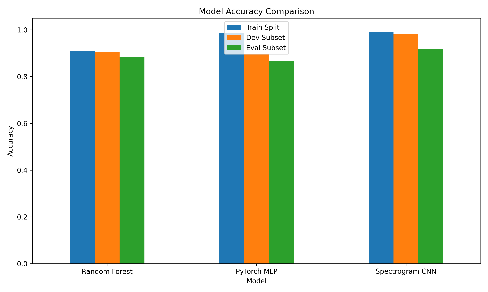

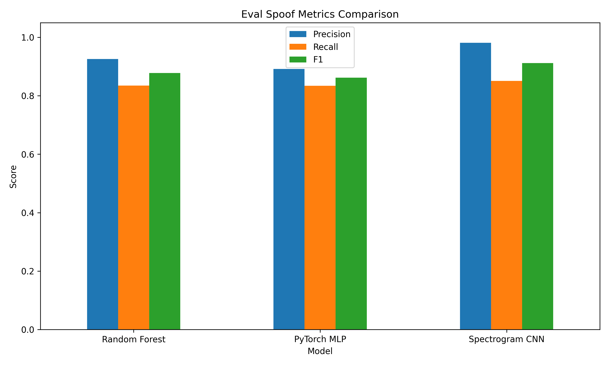

---

### Dev Set Confusion Matrices

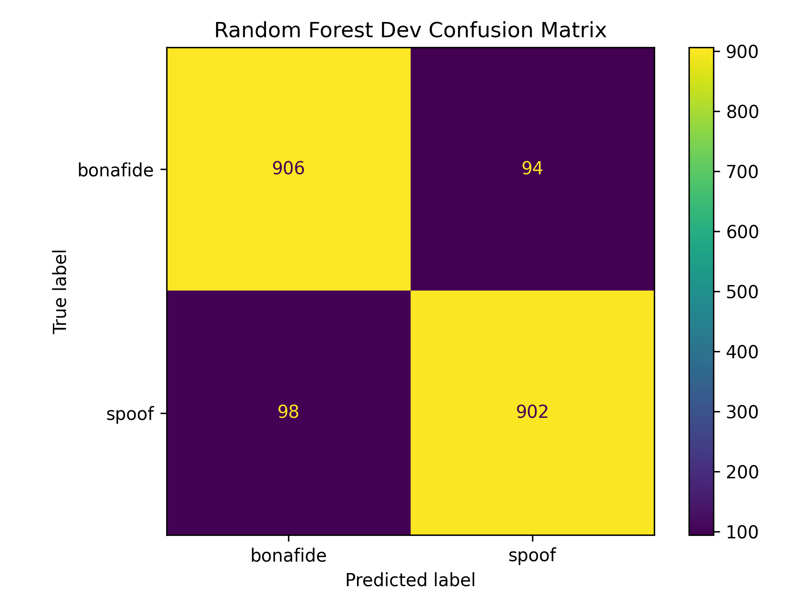

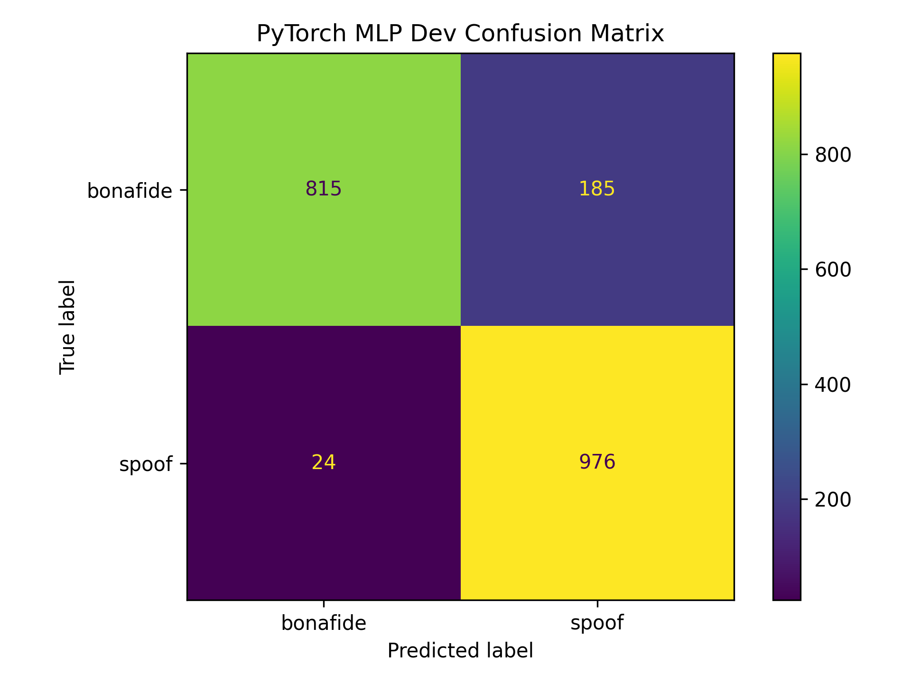


### Eval Set Confusion Matrices

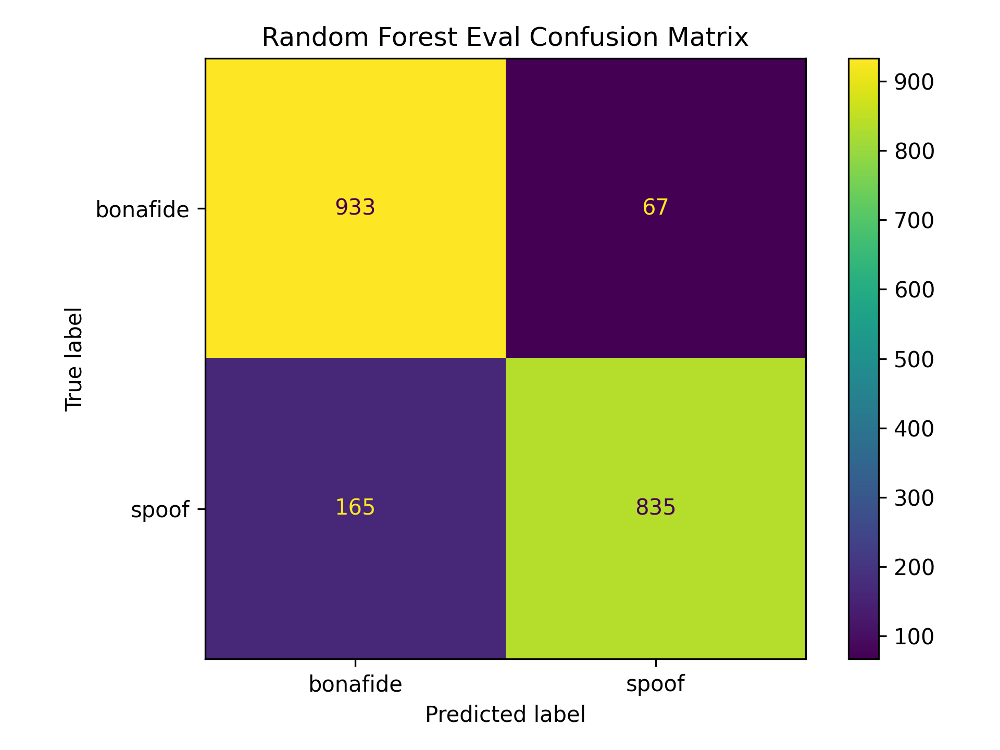

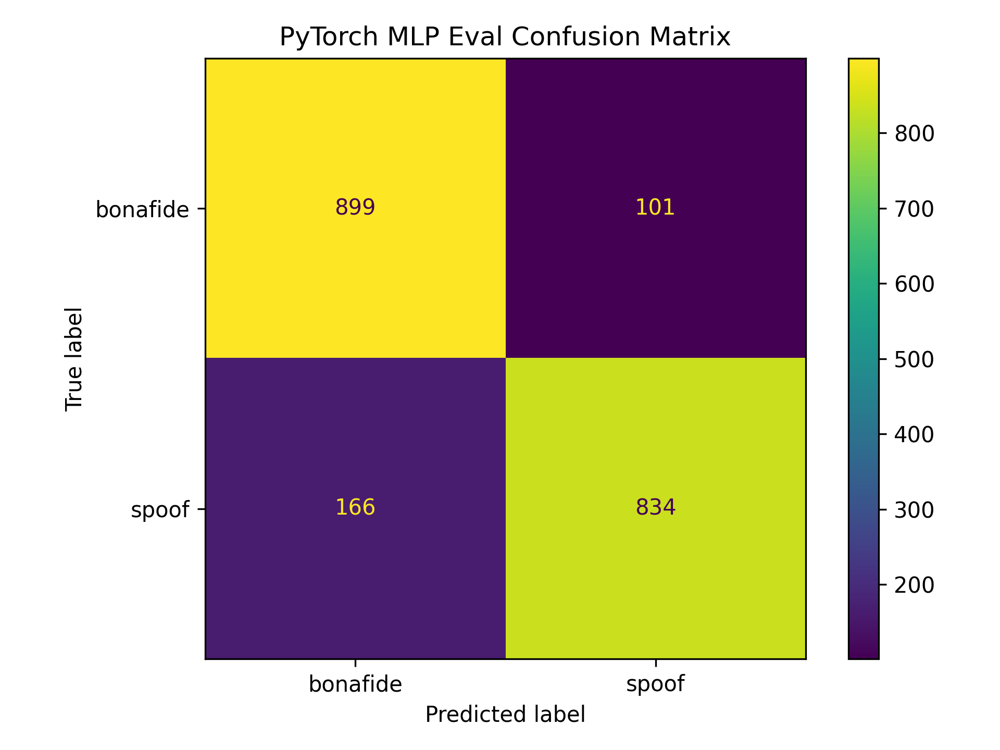

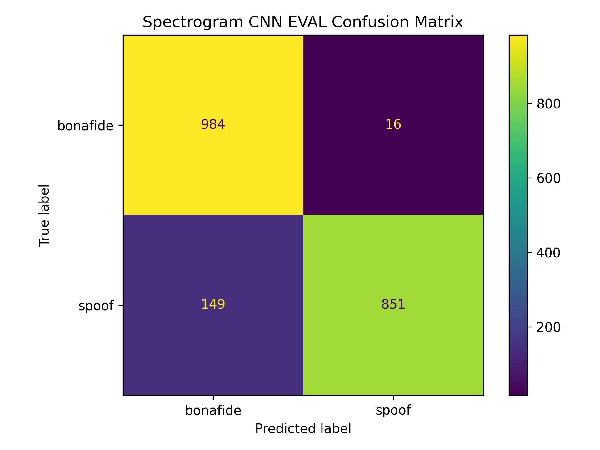

---

## Random Forest Result

The Random Forest baseline achieved strong initial performance using MFCC-based statistical features.


---

## PyTorch MLP Result

The PyTorch MLP achieved strong train split performance using MFCC-based statistical features.


### Training Curves


---

## Spectrogram CNN Result

To extend the project beyond MFCC-based models, I added a CNN model trained on fixed-size mel spectrogram features.

Unlike Random Forest and MLP, which use handcrafted MFCC statistics, the CNN learns directly from time-frequency representations of the audio signal.

The CNN achieved the best overall performance in this project.

### CNN Train Split Result


| Metric                          | Value  |
| ------------------------------- | ------ |
| Best epoch                      | 19     |
| Train split validation accuracy | 0.9925 |
| Spoof precision                 | 0.9900 |
| Spoof recall                    | 0.9950 |
| Spoof F1                        | 0.9925 |


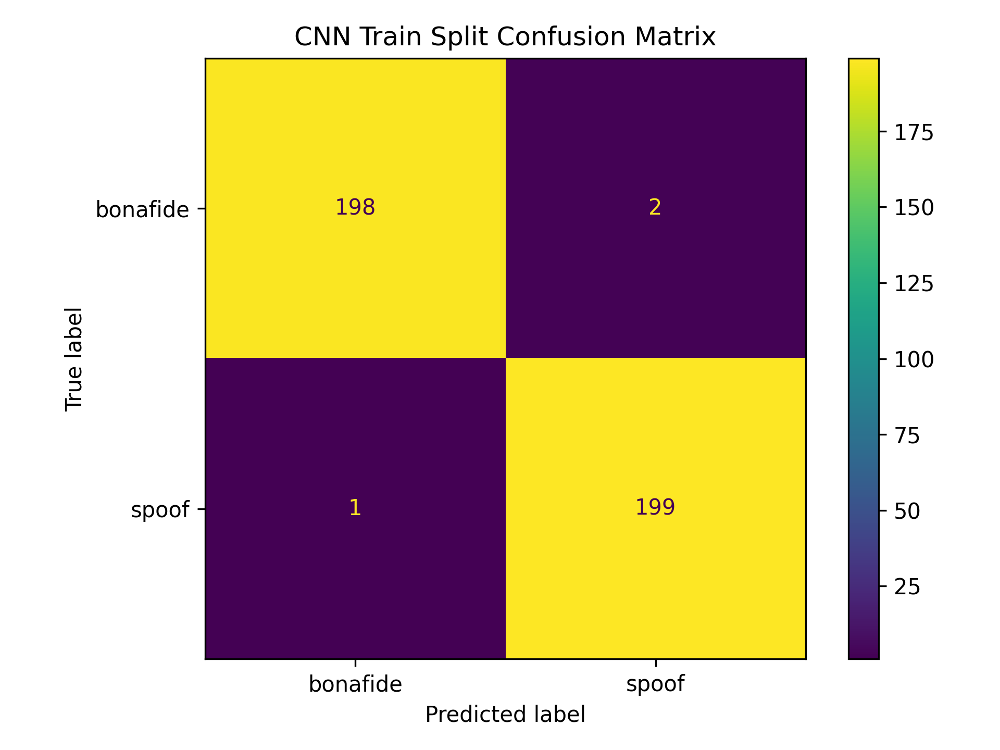

### CNN Training Curves

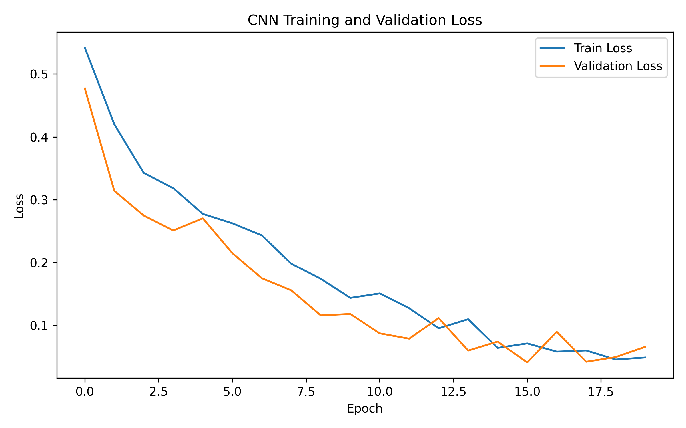

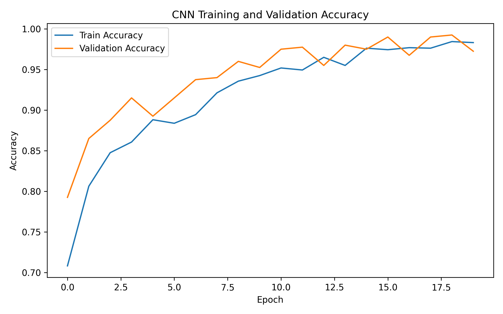

### CNN Dev and Eval Results


| Split | Accuracy | Spoof Precision | Spoof Recall | Spoof F1 |
| ----- | -------- | --------------- | ------------ | -------- |
| Dev   | 0.9815   | 0.9725          | 0.9910       | 0.9817   |
| Eval  | 0.9175   | 0.9815          | 0.8510       | 0.9116   |


The CNN generalized better than the MFCC-based MLP on the dev and eval subsets. This suggests that mel spectrogram representations captured useful time-frequency patterns for spoof detection.

Still, the eval spoof recall was lower than the dev spoof recall. This shows that the eval subset was more challenging and that the model can still be improved.

---

## Adversarial Robustness: FGSM Attack

After evaluating the Spectrogram CNN on the balanced eval subset, I tested its robustness against a basic adversarial attack: Fast Gradient Sign Method (FGSM).

In this experiment, FGSM perturbations were applied to the normalized mel spectrogram tensors used by the CNN.

This is a feature-space adversarial robustness test, not a raw waveform attack.

### FGSM Results on Eval Subset

| Epsilon | Accuracy | Spoof Precision | Spoof Recall | Spoof F1 |
|---:|---:|---:|---:|---:|
| 0.000 | 0.9175 | 0.9815 | 0.8510 | 0.9116 |
| 0.001 | 0.8640 | 0.9365 | 0.7810 | 0.8517 |
| 0.003 | 0.6345 | 0.6336 | 0.6380 | 0.6358 |
| 0.005 | 0.3820 | 0.4056 | 0.5070 | 0.4507 |
| 0.010 | 0.1465 | 0.2227 | 0.2840 | 0.2497 |
| 0.030 | 0.0575 | 0.1031 | 0.1150 | 0.1087 |
| 0.050 | 0.0460 | 0.0842 | 0.0920 | 0.0880 |
| 0.100 | 0.0580 | 0.1039 | 0.1160 | 0.1096 |

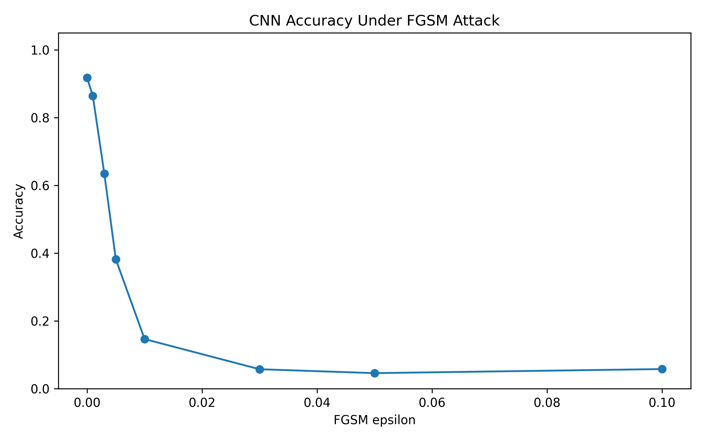

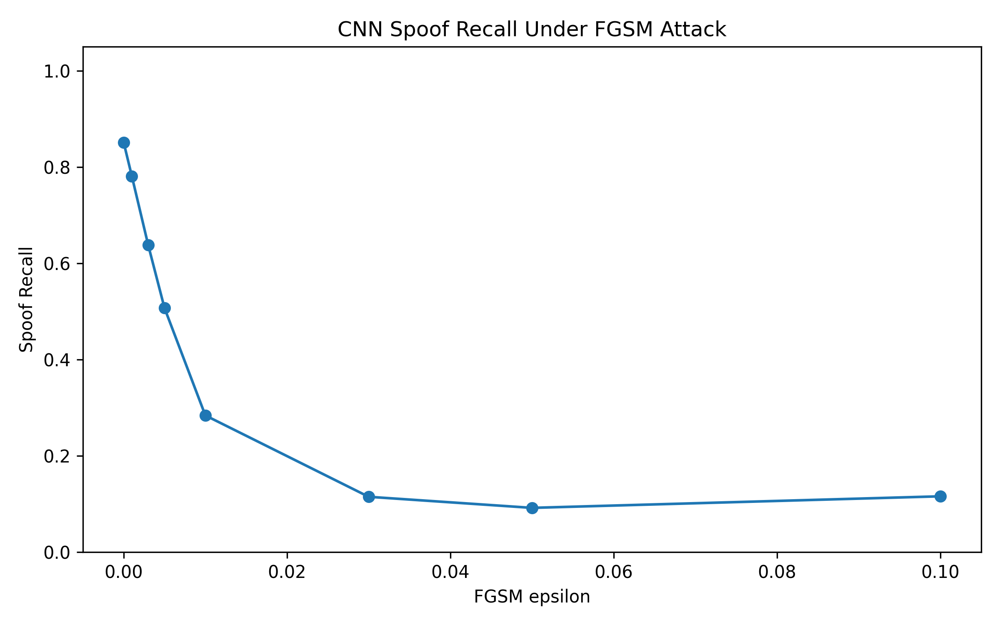

The CNN performed well on the clean eval subset, reaching 0.9175 accuracy. However, its performance dropped sharply under FGSM perturbations.

At epsilon 0.003, accuracy decreased from 0.9175 to 0.6345. At epsilon 0.005, accuracy dropped further to 0.3820.

This shows that high clean accuracy does not necessarily mean the model is robust against adversarial perturbations. For security-related machine learning systems, robustness testing is important in addition to standard accuracy evaluation.

--- 

## Installation

Create and activate a virtual environment:

```bash
python -m venv venv
```

On Windows:

```bash
venv\Scripts\activate
```

Install dependencies:

```bash
pip install -r requirements.txt
```

---

## How to Run

After the source code refactor, scripts are run as Python modules from the project root.

### 1. Check dataset structure

```bash
python -m src.data.check_dataset
python -m src.data.check_dev_dataset
python -m src.data.check_eval_dataset
```

### 2. Create balanced subsets

```bash
python -m src.data.make_subset
python -m src.data.make_dev_subset
python -m src.data.make_eval_subset
```

### 3. Extract MFCC-based features

```bash
python -m src.features.extract_features
python -m src.features.extract_dev_features
python -m src.features.extract_eval_features
```

### 4. Extract mel spectrogram features for CNN

```bash
python -m src.features.extract_mel_features --split train
python -m src.features.extract_mel_features --split dev
python -m src.features.extract_mel_features --split eval
```

You can also process all splits with:

```bash
python -m src.features.extract_mel_features --split all
```

### 5. Train models

```bash
python -m src.models.train_random_forest
python -m src.models.train_mlp
python -m src.models.train_cnn
```

### 6. Evaluate models

```bash
python -m src.evaluation.evaluate_on_dev
python -m src.evaluation.evaluate_on_eval
python -m src.evaluation.evaluate_cnn_on_dev_eval
```

### 7. Run FGSM adversarial attack evaluation

```bash
python -m src.attacks.fgsm_attack
```

### 8. Predict a single audio file

After training the models, you can use the prediction script to classify a single audio file as `bonafide` or `spoof`.

#### Bonafide example

Using the PyTorch MLP model:

```bash
python -m src.models.predict_audio "data/raw/ASVspoof2019_LA_train/flac/LA_T_1138215.flac" --model mlp
```

Example output:

```text
============================================================
Audio Deepfake Prediction
============================================================
Audio file: data\raw\ASVspoof2019_LA_train\flac\LA_T_1138215.flac
Model     : mlp

Prediction: bonafide
Confidence: 1.0000

Class probabilities:
bonafide: 1.0000
spoof   : 0.0000
```

Using the Random Forest model:

```bash
python -m src.models.predict_audio "data/raw/ASVspoof2019_LA_train/flac/LA_T_1138215.flac" --model rf
```

Example output:

```text
============================================================
Audio Deepfake Prediction
============================================================
Audio file: data\raw\ASVspoof2019_LA_train\flac\LA_T_1138215.flac
Model     : rf
Prediction: bonafide
Confidence: 0.5650

Class probabilities:
bonafide: 0.5650
spoof   : 0.4350
```

#### Spoof example

Using the PyTorch MLP model:

```bash
python -m src.models.predict_audio "data/raw/ASVspoof2019_LA_train/flac/LA_T_9334813.flac" --model mlp
```

Example output:

```text
============================================================
Audio Deepfake Prediction
============================================================
Audio file: data\raw\ASVspoof2019_LA_train\flac\LA_T_9334813.flac
Model     : mlp

Prediction: spoof
Confidence: 1.0000

Class probabilities:
bonafide: 0.0000
spoof   : 1.0000
```

Using the Random Forest model:

```bash
python -m src.models.predict_audio "data/raw/ASVspoof2019_LA_train/flac/LA_T_9334813.flac" --model rf
```

Example output:

```text
============================================================
Audio Deepfake Prediction
============================================================
Audio file: data\raw\ASVspoof2019_LA_train\flac\LA_T_9334813.flac
Model     : rf

Prediction: spoof
Confidence: 0.9050

Class probabilities:
bonafide: 0.0950
spoof   : 0.9050
```

> Note: Confidence values are model probabilities rounded to four decimal places. They should not be interpreted as absolute certainty.

---

## Repository Structure

```text
asvspoof-audio-deepfake-detector/
│
├── README.md
├── requirements.txt
├── .gitignore
│
├── data/
│   ├── README.md
│   ├── raw/
│   └── processed/
│
├── notebooks/
│   └── 01_audio_exploration.ipynb
│
├── src/
│   ├── __init__.py
│   ├── config.py
│   ├── utils.py
│   │
│   ├── data/
│   │   ├── __init__.py
│   │   ├── check_dataset.py
│   │   ├── check_dev_dataset.py
│   │   ├── check_eval_dataset.py
│   │   ├── make_subset.py
│   │   ├── make_dev_subset.py
│   │   └── make_eval_subset.py
│   │
│   ├── features/
│   │   ├── __init__.py
│   │   ├── extract_features.py
│   │   ├── extract_dev_features.py
│   │   ├── extract_eval_features.py
│   │   └── extract_mel_features.py
│   │
│   ├── models/
│   │   ├── __init__.py
│   │   ├── train_random_forest.py
│   │   ├── train_mlp.py
│   │   ├── train_cnn.py
│   │   └── predict_audio.py
│   │   
│   ├── attacks/
│   │   ├── __init__.py
│   │   └── fgsm_attack.py
│   │
│   ├── evaluation/
│   │   ├── __init__.py
│   │   ├── compare_results.py
│   │   ├── evaluate_on_dev.py
│   │   ├── evaluate_on_eval.py
│   │   └── evaluate_cnn_on_dev_eval.py
│   │
│   └── visualization/
│       ├── __init__.py
│       └── create_eda_figures.py
│
├── models/
│
└── results/
    ├── figures/
    └── metrics/
```

---

## Limitations

This project is a learning-focused baseline experiment, not a production-ready spoof detection system.

Important limitations:

- The reported results are based on balanced 2,000-sample subsets, not the full ASVspoof benchmark.
- Dev and eval results are based on balanced subsets, not full official ASVspoof scoring.
- The project reports accuracy, precision, recall, and F1, but does not yet report official ASVspoof metrics such as EER or t-DCF.
- The CNN improves generalization, but the eval spoof recall is still not perfect.
- The model was tested with FGSM perturbations on normalized mel spectrogram tensors, but it has not yet been tested with raw waveform-level adversarial audio attacks.

---

## Planned Improvements

- Add raw-audio model baseline
- Add adversarial training defense
- Evaluate robustness under noise and audio transformations
- Test raw waveform-level adversarial attacks
- Write a follow-up article about CNN and adversarial robustness

---

## Author

Built by Elif Abanoz as part of an Audio ML and AI Security learning portfolio.