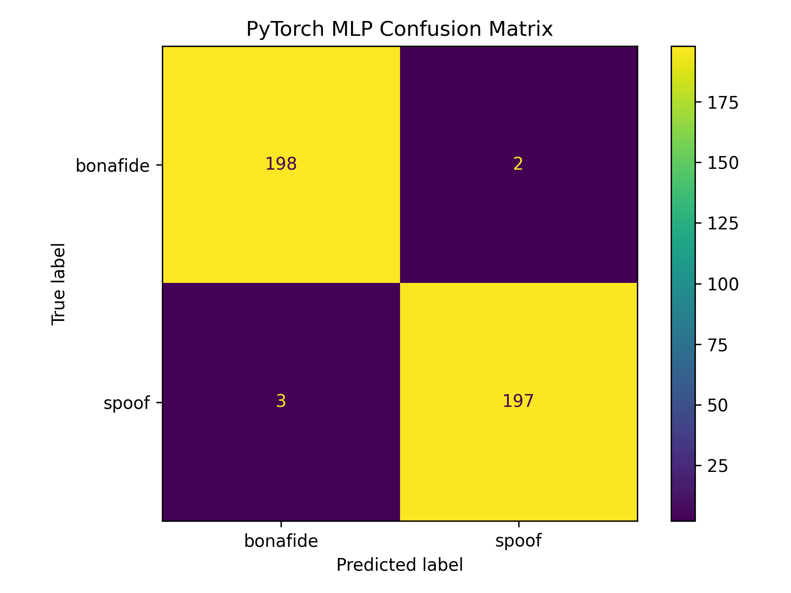
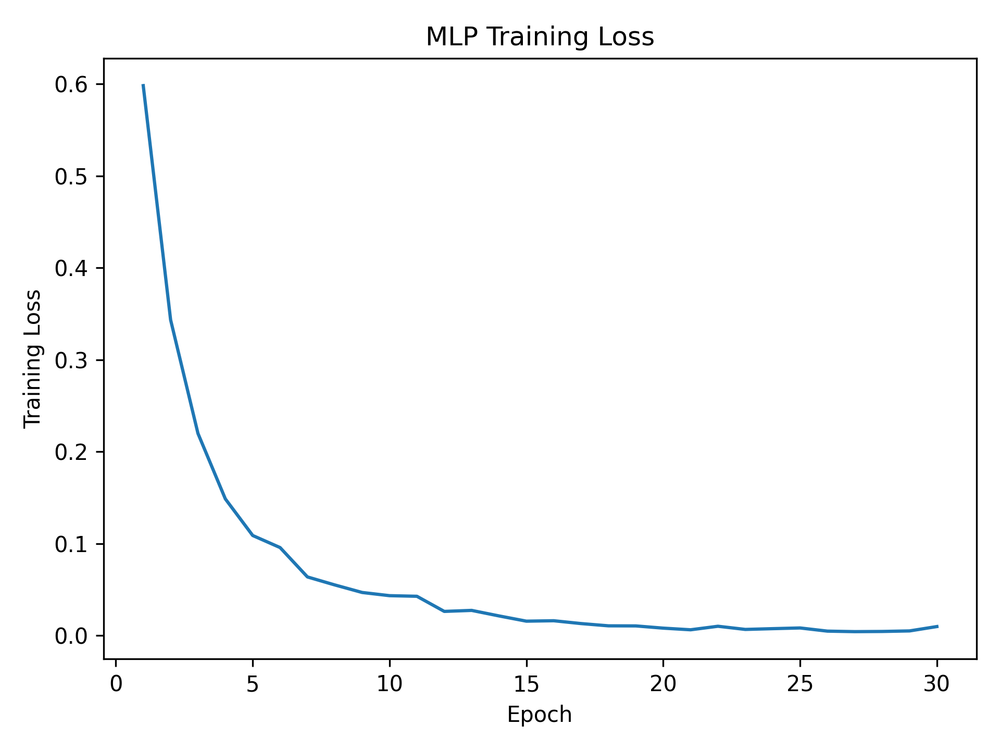
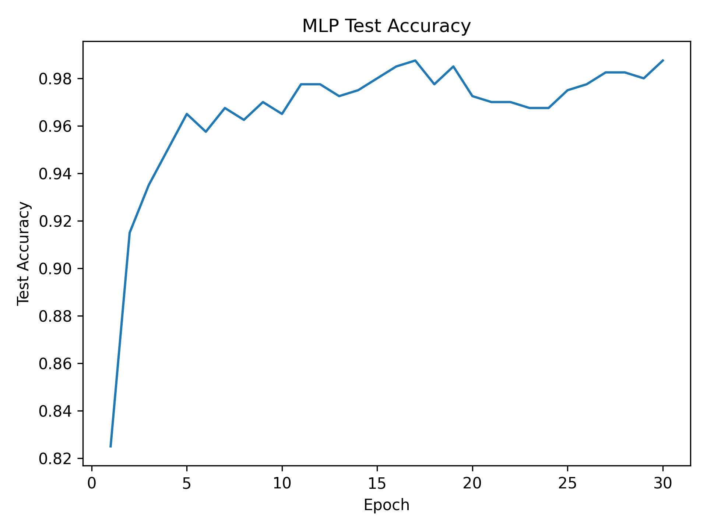

# ASVspoof Audio Deepfake Detector

A machine learning project for detecting synthetic / spoofed speech using the ASVspoof 2019 Logical Access dataset.

This project compares a traditional machine learning baseline with a PyTorch neural network baseline:

- Random Forest classifier
- PyTorch Multi-Layer Perceptron (MLP)

The goal is to build a clean and reproducible audio deepfake detection pipeline using MFCC-based audio features.

---

## Project Overview

Audio deepfakes can be generated using text-to-speech (TTS) and voice conversion (VC) systems.

This project focuses on classifying audio samples as:

- `bonafide`: genuine human speech
- `spoof`: synthetic or manipulated speech

The pipeline follows these steps:

```text
Raw FLAC audio
→ ASVspoof protocol parsing
→ balanced subset creation
→ MFCC + delta + delta-delta feature extraction
→ model training
→ evaluation and comparison
```

---

## Dataset

This project uses the **ASVspoof 2019 Logical Access (LA)** dataset.

The raw dataset is not included in this repository because of size and licensing restrictions.

Expected local dataset structure:

```text
data/
└── raw/
    ├── ASVspoof2019_LA_train/
    │   └── flac/
    └── ASVspoof2019_LA_cm_protocols/
        └── ASVspoof2019.LA.cm.train.trn.txt
```

The project currently uses a balanced subset:

```text
1000 bonafide samples
1000 spoof samples
Total: 2000 audio samples
```

---

## Feature Extraction

For each audio file, the following features are extracted:

- MFCC mean
- MFCC standard deviation
- Delta MFCC mean
- Delta MFCC standard deviation
- Delta-delta MFCC mean
- Delta-delta MFCC standard deviation

With `20 MFCCs`, this produces a 120-dimensional feature vector:

```text
20 + 20 + 20 + 20 + 20 + 20 = 120 features
```

---

## Model Results

The models were trained and evaluated on a balanced 2,000-sample subset of ASVspoof 2019 LA.

| Model | Accuracy | Spoof Precision | Spoof Recall | Spoof F1 |
|---|---:|---:|---:|---:|
| Random Forest | 0.9100 | 0.9409 | 0.8750 | 0.9067 |
| PyTorch MLP | 0.9875 | 0.9899 | 0.9850 | 0.9875 |

---

## Random Forest Result

The Random Forest baseline achieved strong initial performance using MFCC-based statistical features.


---

## PyTorch MLP Result

The PyTorch MLP achieved the best performance in this experiment.



### Training Curves





---

## Installation

Create and activate a virtual environment:

```bash
python -m venv venv
```

On Windows:

```bash
venv\Scripts\activate
```

Install dependencies:

```bash
pip install -r requirements.txt
```

---

## How to Run

### 1. Check dataset structure

```bash
python src/check_dataset.py
```

### 2. Create balanced subset

```bash
python src/make_subset.py
```

### 3. Extract audio features

```bash
python src/extract_features.py
```

### 4. Train Random Forest baseline

```bash
python src/train_random_forest.py
```

### 5. Train PyTorch MLP baseline

```bash
python src/train_mlp.py
```

### 6. Predict a single audio file

After training the models, you can use the prediction script to classify a single audio file as `bonafide` or `spoof`.

#### Bonafide example

Using the PyTorch MLP model:

```bash
python src/predict_audio.py "data/raw/ASVspoof2019_LA_train/flac/LA_T_1138215.flac" --model mlp
```

Example output:

```text
============================================================
Audio Deepfake Prediction
============================================================
Audio file: data\raw\ASVspoof2019_LA_train\flac\LA_T_1138215.flac
Model     : mlp

Prediction: bonafide
Confidence: 1.0000

Class probabilities:
bonafide: 1.0000
spoof   : 0.0000
```

Using the Random Forest model:

```bash
python src/predict_audio.py "data/raw/ASVspoof2019_LA_train/flac/LA_T_1138215.flac" --model rf
```

Example output:

```text
============================================================
Audio Deepfake Prediction
============================================================
Audio file: data\raw\ASVspoof2019_LA_train\flac\LA_T_1138215.flac
Model     : rf

Prediction: bonafide
Confidence: 0.5650

Class probabilities:
bonafide: 0.5650
spoof   : 0.4350
```

#### Spoof example

Using the PyTorch MLP model:

```bash
python src/predict_audio.py "data/raw/ASVspoof2019_LA_train/flac/LA_T_9334813.flac" --model mlp
```

Example output:

```text
============================================================
Audio Deepfake Prediction
============================================================
Audio file: data\raw\ASVspoof2019_LA_train\flac\LA_T_9334813.flac
Model     : mlp

Prediction: spoof
Confidence: 1.0000

Class probabilities:
bonafide: 0.0000
spoof   : 1.0000
```

Using the Random Forest model:

```bash
python src/predict_audio.py "data/raw/ASVspoof2019_LA_train/flac/LA_T_9334813.flac" --model rf
```

Example output:

```text
============================================================
Audio Deepfake Prediction
============================================================
Audio file: data\raw\ASVspoof2019_LA_train\flac\LA_T_9334813.flac
Model     : rf

Prediction: spoof
Confidence: 0.9050

Class probabilities:
bonafide: 0.0950
spoof   : 0.9050
```

> Note: Confidence values are model probabilities rounded to four decimal places. They should not be interpreted as absolute certainty.

---

## Repository Structure

```text
asvspoof-audio-deepfake-detector/
│
├── README.md
├── requirements.txt
├── .gitignore
│
├── data/
│   ├── README.md
│   ├── raw/
│   └── processed/
│
├── notebooks/
│   └── 01_audio_exploration.ipynb
│
├── src/
│   ├── config.py
│   ├── check_dataset.py
│   ├── make_subset.py
│   ├── extract_features.py
│   ├── train_random_forest.py
│   ├── train_mlp.py
│   ├── evaluate.py
│   └── utils.py
│
├── models/
│
└── results/
    ├── figures/
    └── metrics/
```

---

## Limitations

This project is currently a baseline experiment.

Important limitations:

- The reported results are based on a balanced 2,000-sample subset, not the full ASVspoof benchmark.
- The models use handcrafted MFCC-based features instead of raw waveform learning.
- Evaluation is performed using a train/test split from the training partition.
- The current version does not yet evaluate on the official ASVspoof dev or eval partitions.
- The model has not yet been tested against adversarial audio attacks.

---

## Next Steps

Planned improvements:

- Evaluate on ASVspoof dev and eval sets
- Add CNN-based spectrogram model
- Add raw-audio model baseline
- Implement adversarial attacks such as FGSM
- Add adversarial training defense
- Add inference script for single audio prediction
- Write a technical Medium article explaining the pipeline

---

## Author

Built by Elif Abanoz as part of an Audio ML and AI Security learning portfolio.
